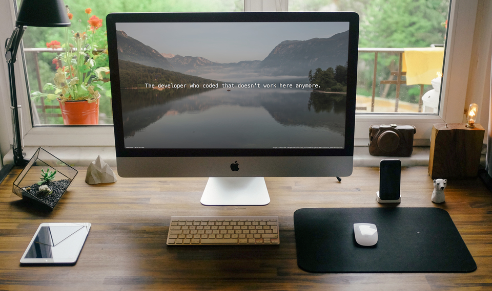
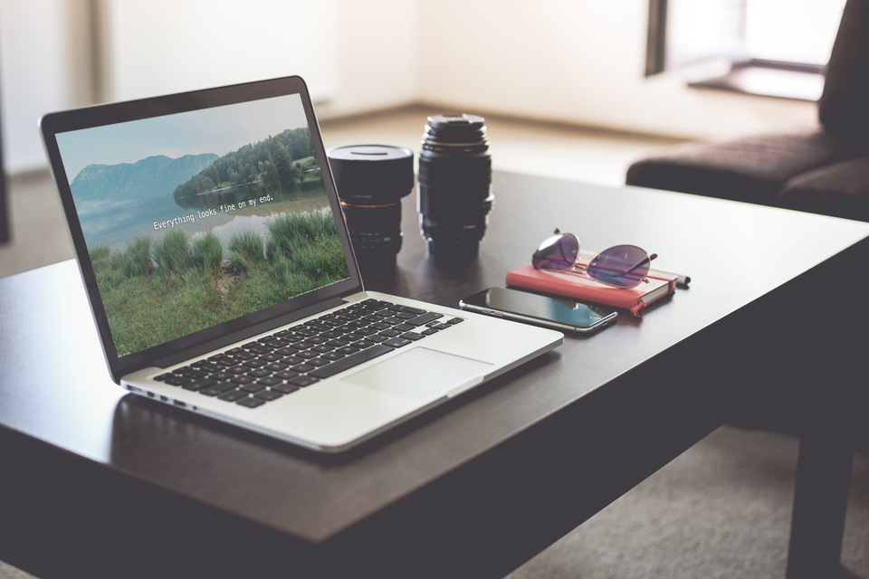
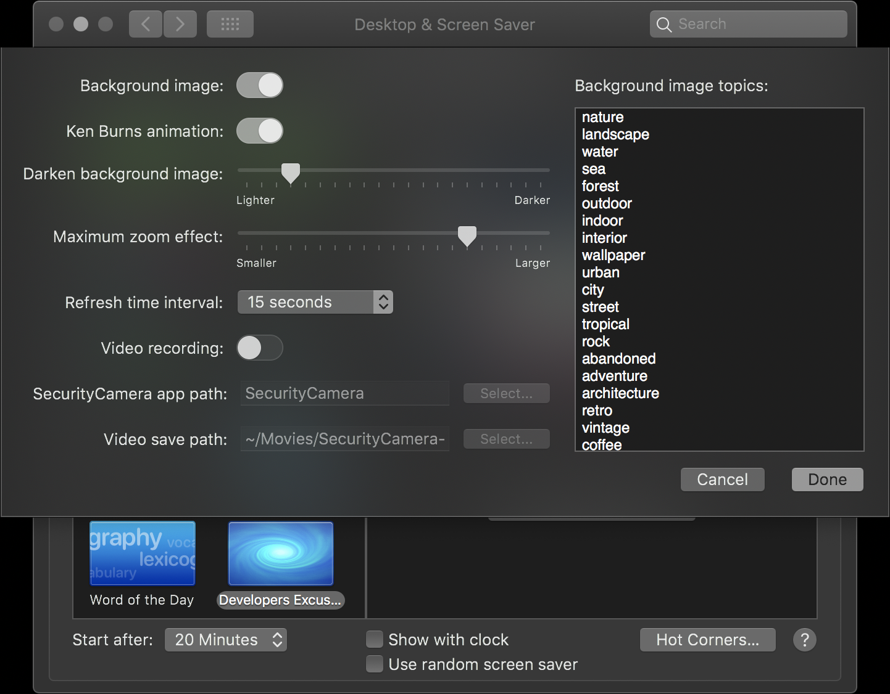

# Developers Excuses

  

A macOS screen saver that shows a random [developer excuse](http://www.devexcuses.com) over a [beautiful photo background](https://unsplash.com). Made with ❤

## Features
* Periodically refresh the background image from [Unsplash](https://unsplash.com)
* Periodically refresh the quote from [Developer Excuses](http://www.devexcuses.com)
* Animate the background image with [Ken Burns effect](https://en.wikipedia.org/wiki/Ken_Burns_effect)
* Automatically start recording video using the built-in FaceTime HD camera for security reasons

## Configurations

## Downloads
### [Screen Saver](Releases/1.7/screensaver.zip)
Double-click to install.

### [Security Camera](Releases/1.7/SecurityCamera.zip)
Place it to somewhere handy, such as `~/Downloads` or `/usr/bin`, and then update its path in the screen saver configurations .

## Compatibility
Developers Excuses screen saver requires OS X Catalina or later.

**Note**: Apple has tightened up security in 10.15.4 and above. Although this application is safe, you may experience problems getting macOS to allow this application to run, since the Github builds are not notarized. If you experience this issue, you can try to build the application yourself using the directions below.

## How to build
0. Install [CocoaPods](https://cocoapods.org)
1. Install [SwiftLint](https://github.com/realm/SwiftLint)
2. `git clone git@github.com:ayltai/MacOS-Developers-Excuses.git`
3. `cd MacOS-Developers-Excuses`
4. Run `pod install`
5. Open `DevExcuses.xcworkspace` in Xcode
6. Build DevExcuses projects (`Command-B`)
  * You may get some warnings. They are generally self-explanatory. Make adjustments, as you wish for your preferences.
7. Optionally build SecurityCamera project if you want to use the camera of your MacBook to record videos for security reason
8. Right-click in your Xcode Project Navigator > DevExcuses > Products > Developer Excuses.saver
9. Select "Open with External Editor"
